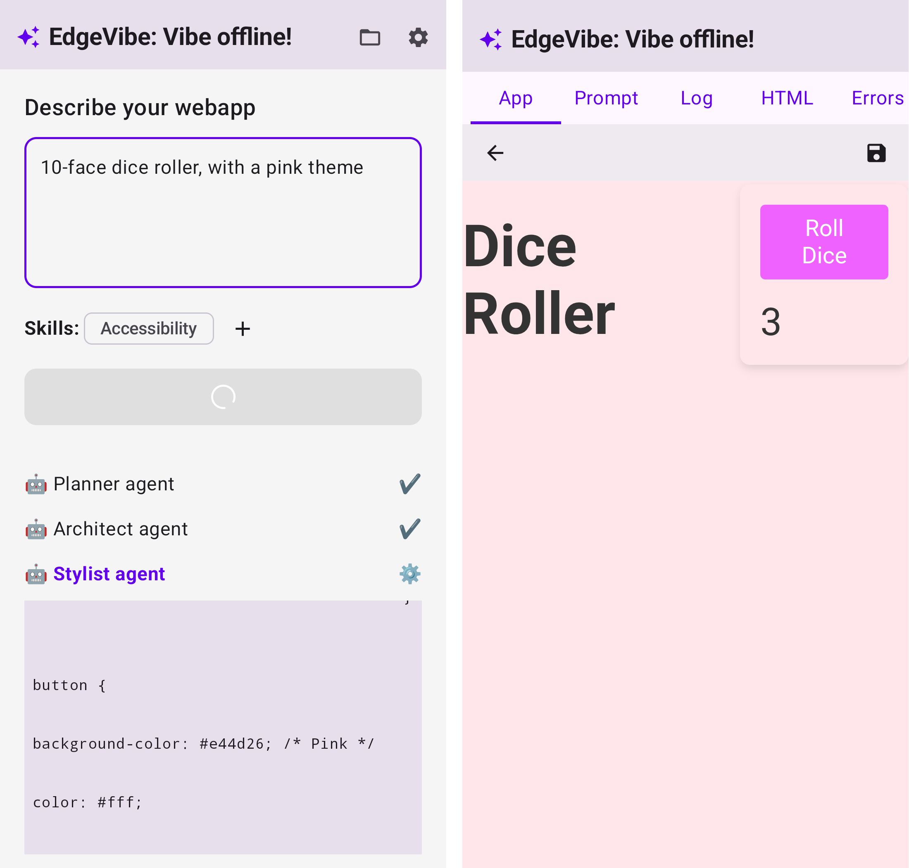

# EdgeVibe



EdgeVibe is an Android app that generates mini-apps from natural language prompts. It works entirely locally, without an internet connection.

## Features
- **Multi-Agent Generation**: Uses an agentic pipeline.
- **Local LLMs**: Supports MLKit, AI Edge SDK (Gemini Nano), and Qwen 3.5 (MediaPipe).
- **Skills System**: Define skills for the agents to use.

## Use cases

- Playing with friends in a mountain hut, and you suddenly need a 10-sided dice?
- Bored in the plane and want a math quizz?
- Need to convert Fahrenheit to Celsius but the data is so private you can't use an online converter?
- Interval training in the forest?

EdgeVibe is for you! :-)

## Building and Running
Connect your Android device and run:
```bash
./gradlew installDebug
```